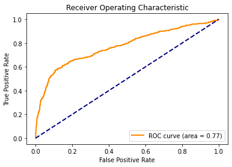
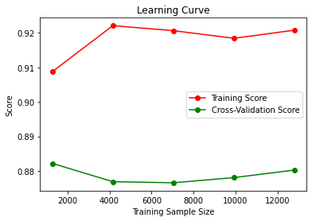

# AI-Marketing-Campaign
Hypertunes a variety of classifiers to optimize call lists for marketing campaigns.

## Choice of Metric
I chose the recall metric as the scoring metric since my goal was to maximize the true positive rate. This is so that the script can be run on a large unfiltered call list, and output a smaller call list that would in the maximum income. Using recall will maximize the number of true positives in our test data. This means when our model predicts a person will help our campaign, it is far more likely than say a randomly sampled person contributing.

## Overall Performance
From a high level, we see that the Logistic Regression model performed the best in accuracy, but the KNN model performed the best in recall. The SVM model was actually higher in accuracy and precision than the others, but it was ineffective considering the training time (8 hours or so), given that we don't want to spend the amount of resources on training a SVM for this process.
| Model                          | Accuracy | Precision | Recall   | F1 Score | Training Time | ROC AUC  |
|--------------------------------|----------|-----------|----------|----------|---------------|----------|
| Logistic Regression            | 0.90150  | 0.772205  | 0.599821 | 0.633795 | 5.614763      | 0.772186 |
| K Nearest Neighbors (KNN)      | 0.88600  | 0.684252  | 0.611421 | 0.634533 | 100.127706    | 0.673773 |
| Decision Tree                  | 0.84700  | 0.603758  | 0.603758 | 0.603758 | 61.829505     | 0.600929 |
| Support Vector Machine (SVM)   | 0.90175  | 0.781962  | 0.591845 | 0.624555 | 28535.285451  | NaN      |

### ROC Curve
The ROC Area Under the Curve is best for the Logistic Regression model:

### Training Sample Size
While most of the models would not have benefitted much from more data, the KNN model may benefit from more data classification points:

## Feature Importance
We can also see from the decision tree which features were most important:

- campaign: number of contacts performed during this campaign and for this client
- euribor3m: euribor 3 month rate - daily indicator
- nr.employed: number of employees - quarterly indicator

We can see that (apart from age) there are two major telling indicators on the success of a marketing call, and they are:
1) How many times someone has been contacted already during the campaign.
2) The socio-economic climate.

These two factors seem to be the most important in swaying the tide for hearing a "yes" from a prospective campaign marketing call, which is important to keep in mind if in the field.
