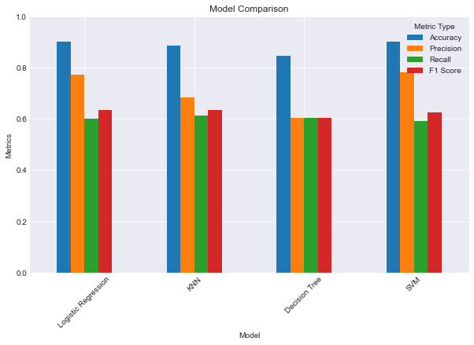

# AI-Marketing-Campaign
Hypertunes a variety of classifiers to optimize call lists for marketing campaigns.

## Recall Metric
I chose the recall metric as the scoring metric since the goal to me was to maximize the true positive rate. This is so that the script can be run on a large unfiltered call list to output a smaller call list that brings in the maximum income. Since we are using recall, we will maximize the actual amount of true positives in our test data. This means when our model predicts the person will donate, they are far more likely to donate than a randomly sampled person.

## Overall Performance
From a high level picture, we can see that the Logistic Regression model performed the best in accuracy, but the KNN model performed the best in recall. The SVM model was higher in accuracy and precision than the others, but it was ineffective considering the training time (8 hours or so), given that we don't want to spend the amount of resources on training a SVM for this process.
| Model                          | Accuracy | Precision | Recall   | F1 Score | Training Time | ROC AUC  |
|--------------------------------|----------|-----------|----------|----------|---------------|----------|
| Logistic Regression            | 0.90150  | 0.772205  | 0.599821 | 0.633795 | 5.614763      | 0.772186 |
| K Nearest Neighbors (KNN)      | 0.88600  | 0.684252  | 0.611421 | 0.634533 | 100.127706    | 0.673773 |
| Decision Tree                  | 0.84700  | 0.603758  | 0.603758 | 0.603758 | 61.829505     | 0.600929 |
| Support Vector Machine (SVM)   | 0.90175  | 0.781962  | 0.591845 | 0.624555 | 28535.285451  | NaN      |

### Charts

We can also see from the decision tree which features were most important:

